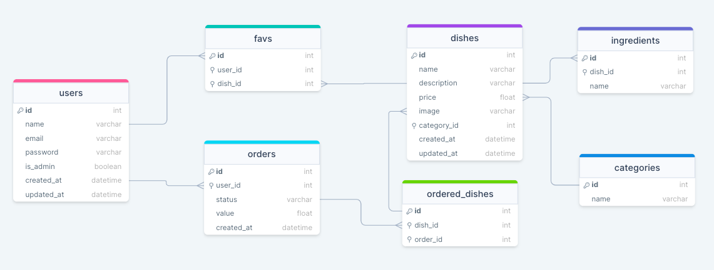

# Explorer Course by Rocketseat

## Food Explorer Backend API - 🍔

Food Explorer is the final challenge application of the Explorer course from [Rocketseat School](https://www.rocketseat.com.br/).

This API works together with the frontend app that can be seen here: [Food Explorer Frontend](https://github.com/cah90/foodexplorer-frontend).

The aim of this project was to create an API application for a restaurant that allows the administrator of the app to create, edit and delete dishes and the regular users of the app to be able to login, create an account, see the restaurant dishes, see each dish in detail with pictures, description and ingredients and then place orders.

You can check the final result of the app by clicking here - [Food Explorer APP](https://rocketseat-foodexplorer.netlify.app/).

## Database Diagram

<h1 align="center">
  
</h1>

## Technologies

The main technologies used:

- NodeJS
- JavaScript
- SQLite
- Express.js

## Tools used for local development

- Insomnia - It can be download [here](https://insomnia.rest/download)

- Beekeper - It can be dowload [here](https://www.beekeeperstudio.io/get)

- It is also important to have NodeJS installed in your computer, you can download it [here](https://nodejs.dev/pt/)

## Installation

There are two ways of installing this project in your computer.

1. You can download the project through GitHub by clicking in the button "Code" then "Download ZIP".

2. Or you can clone it using your terminal.

### Steps when using the terminal

Open your terminal and type the following command:

```
git clone https://github.com/cah90/foodexplorer-backend.git
```

Having the first step done, you can access the folder that contains the app.

```
cd foodexplorer-backend
```

Now, install all the dependencies that the project will need.

```
npm install
```

Now you can run the migrations for building a new database tables.

```
npm run migrate
```

You can now iniciate the project.

```
npm run dev
```

💡 If everything worked, you will see a message on your terminal saying that your server is <u>running on port 3333</u>.

## Usage

After having your API running, it is possible to send HTTP requests to the application using [Insomnia](https://insomnia.rest/download).

The API receives requests in the hostname "http://localhost:3333"

> 🔥 **Attention** </br>
> To be able to test the admin routes, it is necessary to change > the **role** in the **users** table to **admin**.
> One way of changing it, it through the software [beekeper](https://>www.beekeeperstudio.io/get).

### Creating a new user

POST /users

```
{
	"name": "Example",
	"email": "example@gmail.com",
	"password": "123456"
}
```

### Creating a session

POST /sessions

```
{
	"email": "example@gmail.com",
	"password": "123456"
}
```

### Creating a dish

POST /dishes

**Obs:** It's necessary to send this payload using multipart on Insomnia.

**Obs:** This routes is only available for the admin user.

```
name: plate name
description: example of a description of a plate
price: 19.99
ingredients: powder, water
category_id: 2
image: imageFile.png
```

### Updating a dish

POST /dishes/:id

**Obs:** It's necessary to send this payload using multipart on Insomnia.

**Obs:** This routes is only available for the admin user.

```
name: plate name
description: example of a description of a plate
price: 19.99
ingredients: powder, water
category_id: 2
image: imageFile.png
```

### Deleting a dish

DELETE /dishes/:id

**Obs:** This routes is only available for the admin user.

### Showing all dishes

GET /dishes

### Showing an specific dish

GET /dishes/:id

## License

[MIT](https://choosealicense.com/licenses/mit/)

## Author

Made by Cássia Bernardo ❤️
